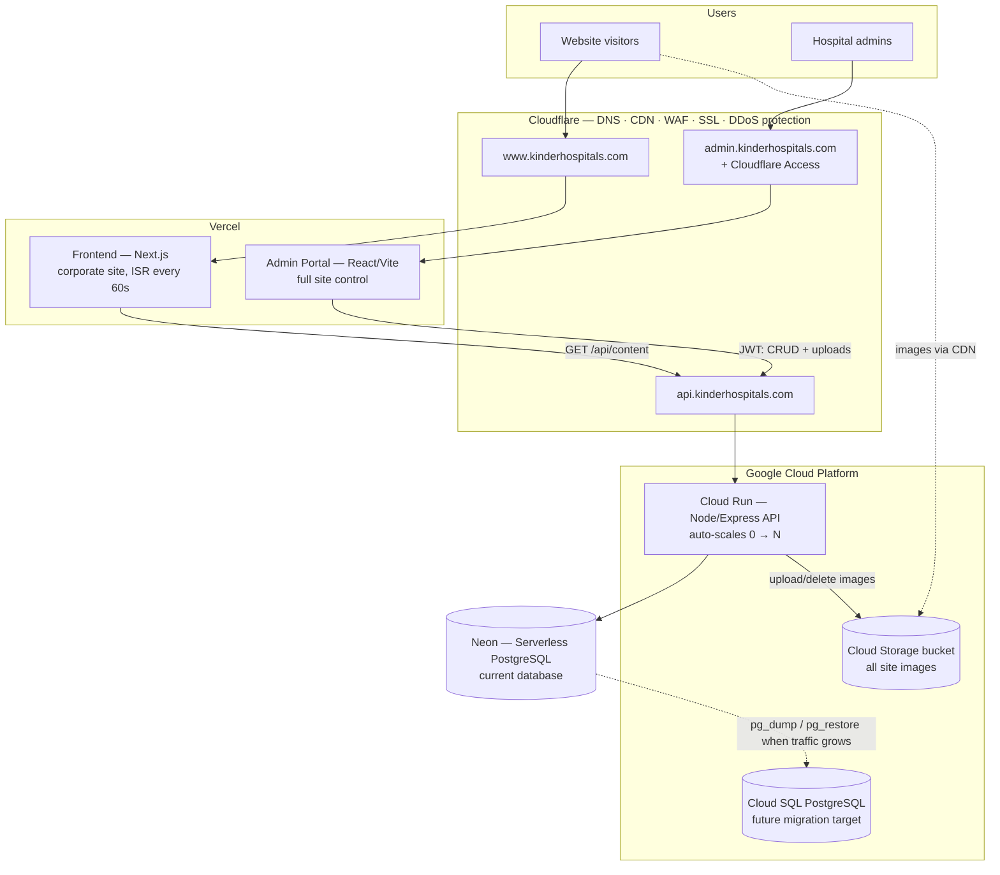

# Kinder Hospitals — System Architecture

## The four repositories

| Repo | What it is | Deployed on |
|---|---|---|
| `webdomainkinderhospitals/backend` | Express + Prisma API, image uploads, auth | GCP Cloud Run |
| `webdomainkinderhospitals/Frontend` | Next.js corporate site (from the approved design) | Vercel |
| `webdomainkinderhospitals/admin` | Kinder Hospital admin portal — all control lives here | Vercel |
| `SABI9666/SuperAdmin` | Your personal launcher — just link cards to view the sites | GitHub Pages (unchanged) |

## How content flows

1. Admin logs into the **admin portal** and edits content or uploads an image.
2. The portal calls the **Cloud Run API** with a JWT; images go to the **GCS bucket**, data to **Neon Postgres**.
3. The **Next.js frontend** re-fetches `GET /api/content` every 60 seconds (ISR), so changes go live within a minute — no redeploy needed.
4. **Cloudflare** sits in front of every hostname: free SSL, caching, WAF, DDoS protection, and (recommended) Cloudflare Access locking the admin subdomain to your team's emails.

## Why this scales cheaply

- **Vercel** serves the site as cached static pages regenerated in the background — traffic spikes never touch your API for page views.
- **Cloud Run** scales to zero when idle (you pay ~nothing at low traffic) and scales out automatically under load.
- **Neon** is serverless Postgres with a generous free tier; when sustained heavy traffic arrives, migrate to **Cloud SQL** by changing one environment variable (`DATABASE_URL`) — Prisma and the code stay identical. Steps are in `README.md`.
- **GCS + Cloudflare** serve images from CDN cache, not from your server.
